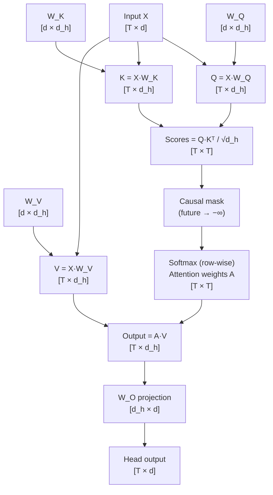
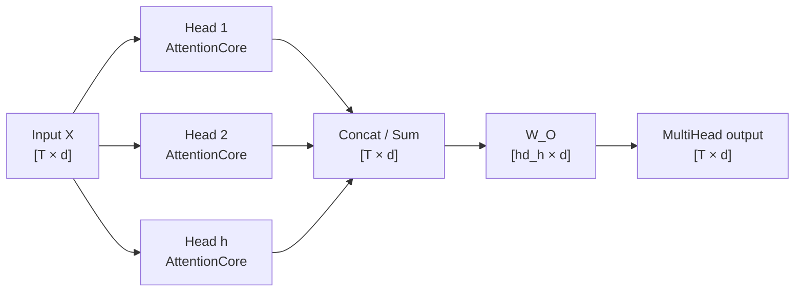
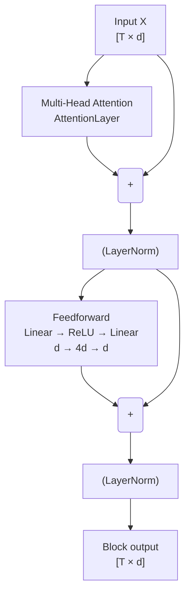
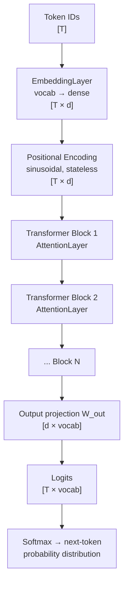

# How Attention Works — and What Else an LLM Needs

---

## The Core Idea

A standard neural network treats every input position identically and independently. Attention lets each token in a sequence **look at every other token** and decide how much to "attend" to it when producing its own output. This is how a model learns that in *"The cat sat on the mat because **it** was tired"*, the word *it* refers to *cat* and not *mat*.

---

## Scaled Dot-Product Attention (One Head)

Given an input sequence of $T$ tokens, each represented as a vector of dimension $d$:

$$
\text{Attention}(Q, K, V) = \text{softmax}\!\left(\frac{QK^T}{\sqrt{d_{\text{head}}}}\right) V
$$

| Matrix | Shape | Meaning |
|--------|-------|---------|
| $Q = X W_Q$ | $[T, d_h]$ | **Query** — "what am I looking for?" |
| $K = X W_K$ | $[T, d_h]$ | **Key** — "what do I contain?" |
| $V = X W_V$ | $[T, d_h]$ | **Value** — "what do I pass forward if selected?" |
| $A = \text{softmax}(QK^T/\sqrt{d_h})$ | $[T, T]$ | **Attention weights** — how much each token attends to each other |
| Output $= AV$ | $[T, d_h]$ | Weighted mix of values |

The $\sqrt{d_h}$ scale prevents the dot products from growing too large and pushing softmax into saturation (near-zero gradients).

---

## Single-Head Forward Pass — Step by Step

**Causal mask:** positions $j > i$ are set to $-\infty$ before softmax, so token $i$ can only attend to tokens $0 \ldots i$. This is what makes it an autoregressive (left-to-right) language model — the model cannot "cheat" by looking at future tokens during training.

---

## Multi-Head Attention

Run $h$ independent heads in parallel, each with its own $W_Q^{(i)}, W_K^{(i)}, W_V^{(i)}$ and $d_h = d / h$. Concatenate outputs, project back to $d$:

$$
\text{MultiHead}(X) = \text{Concat}(\text{head}_1, \ldots, \text{head}_h)\, W_O
$$

Each head learns to attend to a **different relationship** — one head might track syntactic dependencies, another co-reference, another local n-gram patterns.

---

## Transformer Block (AttentionLayer)

A single transformer block wraps multi-head attention in residual connections and adds a position-wise feedforward network:

The **feedforward** sub-block applies independently to each position — no cross-position mixing — and uses a 4× wider hidden dimension ($d_{ff} = 4d$) to give each token enough capacity to transform its representation.

---

## Full Transformer Pipeline (TransformerBus)

During **training**, cross-entropy loss is computed at every position (teacher forcing: use the ground-truth token at position $t$ as input, predict token $t+1$). Gradients flow back through the entire pipeline via standard backprop.

---

## Backpropagation Through Attention

The tricky part. Working backwards:

1. **Output projection** $W_O$: standard linear layer backprop
2. **$A \cdot V$**: $dV = A^T \cdot dO$, $dA = dO \cdot V^T$
3. **Softmax**: $d\text{scores}_{i,j} = A_{i,j}(dA_{i,j} - \sum_k A_{i,k} dA_{i,k})$
4. **Scale**: $d\text{scores} \mathrel{/}= \sqrt{d_h}$
5. **$Q K^T$**: $dQ = d\text{scores} \cdot K$, $dK = d\text{scores}^T \cdot Q$
6. **Projections**: $dW_Q = X^T dQ$, $dX \mathrel{+}= dQ \cdot W_Q^T$ (and same for K, V)

**Critical implementation note:** all downstream gradients ($dX$, etc.) must be computed **before** weight matrices are updated. Updating $W_Q$ then computing $dX = dQ \cdot W_Q^T$ uses corrupted weights — this was the root bug found and fixed in `AttentionCore`.

---

## What's in This Implementation

| Component | File | Status |
|-----------|------|--------|
| Token embedding table | `EmbeddingLayer.cs` | ✅ |
| Sinusoidal positional encoding | `PositionalEncoding.cs` | ✅ |
| Single attention head (Q/K/V + causal mask + backprop) | `AttentionCore.cs` | ✅ |
| Multi-head attention + feedforward block + residuals | `AttentionLayer.cs` | ✅ |
| Full pipeline: embed → PE → N layers → logits → loss → backprop | `TransformerBus.cs` | ✅ |
| Gradient norm clipping (prevents explosion) | `TransformerBus.cs` | ✅ |

---

## What's Missing for a Production LLM

The implementation above is a **correct, trainable transformer**. It will converge. But production LLMs add several components that matter for quality and stability at scale:

### Stability / Training Quality

| Missing piece | Why it matters | Complexity to add |
|---------------|----------------|-------------------|
| **Layer Normalisation** (Pre-LN) | Stabilises gradients — without it, deep models (>4 layers) are fragile; Pre-LN (before attention, not after) is the modern standard | Low — one `LayerNorm` class |
| **Gradient clipping by global norm** | Currently clips per-tensor; clipping the global norm across all parameters is stronger | Low |
| **Learning rate schedule** (warmup + cosine decay) | Flat LR causes poor convergence at scale; warmup prevents early instability | Low — external to the model |
| **Weight tying** (embedding ↔ output projection) | Standard trick: share `EmbeddingLayer` weights with `W_out` — reduces params by `vocab × d`, improves perplexity | Low |

### Architecture Variants

| Missing piece | Why it matters | Complexity to add |
|---------------|----------------|-------------------|
| **RoPE / ALiBi positional encoding** | Sinusoidal PE used here doesn't generalise to longer sequences than seen during training; RoPE (used in LLaMA, Mistral) does | Medium |
| **SwiGLU / GeLU activation** | ReLU in the feedforward block loses ~50% of activations (dead neurons); GeLU/SwiGLU converges faster | Low — swap activation function |
| **KV-cache** (inference only) | During inference, re-computing K and V for the full context on every token is $O(T^2)$; caching them makes it $O(T)$ | Medium — inference path only |
| **Grouped Query Attention (GQA)** | Shares K/V heads across Q heads — reduces memory and computation at inference; used in LLaMA 3, Gemma | Medium |

### Training Infrastructure

| Missing piece | Why it matters | Complexity to add |
|---------------|----------------|-------------------|
| **Mini-batch training** | Currently trains one sequence at a time; batching improves GPU utilisation and gradient quality | Medium — batch dimension throughout |
| **Tokeniser (BPE / WordPiece)** | Current implementation is byte-level (vocab=256); word-level or BPE tokenisation (vocab ~32K–100K) is needed for real language quality | High — separate library |
| **Checkpoint / weight serialisation** | No save/load — model retrains from scratch each run | Low |
| **Mixed-precision (fp16/bf16)** | Needed for GPU training speed; irrelevant for FPGA target but matters for pre-training reference runs | Medium |

### For the FPGA/Silicon Target Specifically

| Missing piece | Why it matters |
|---------------|----------------|
| **LayerNorm on FPGA** | Requires running mean/variance over 64–128 values — feasible with a shift-register accumulator, but not yet in the HDL plan |
| **Fixed-point softmax LUT** | Already planned in ROADMAP (256-entry BRAM LUT for `exp()`); needs validation against float reference |
| **Weight quantisation (Q8 / Q4)** | At 100K params and 8-bit, weights fit in ~100 KB SRAM on SKY130; fp32 would need 400 KB (too large) |

---

## Priority Order for Phase 2a Completion

To reach the *"perplexity < 5.0 on Shakespeare after 20 epochs"* gate:

1. **LayerNorm** — the single highest-impact missing piece for training stability beyond 2 layers
2. **GeLU activation** — replace ReLU in feedforward (one-line change, measurable perplexity improvement)
3. **Weight tying** — free perplexity gain, reduces params
4. **LR schedule** — cosine decay from step 0 to end of training
5. **Mini-batch** — needed for throughput benchmark vs PyTorch nanoGPT

Items 2–5 are each under 50 lines of code. LayerNorm is ~30 lines plus integration into `AttentionLayer`.
