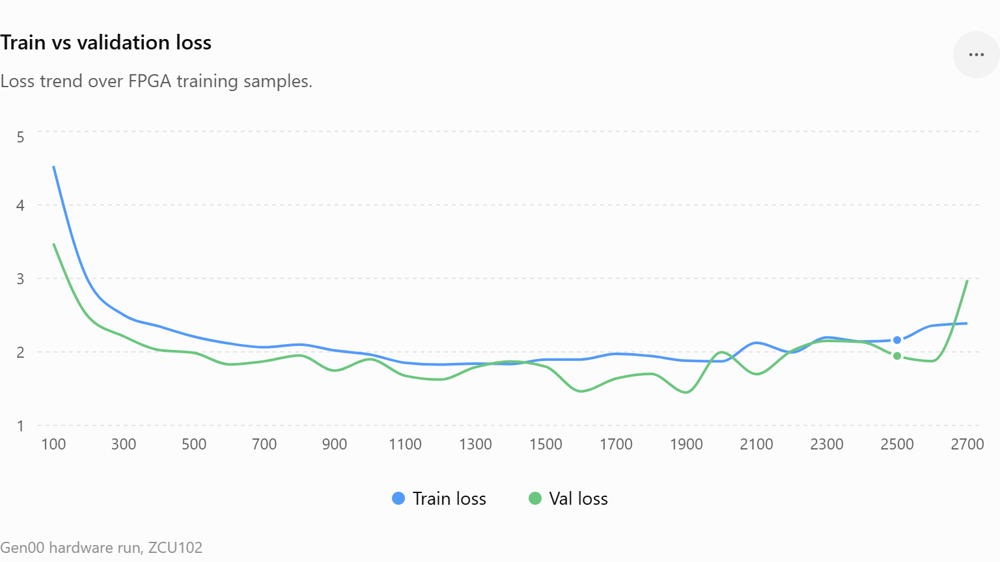

# Week 7 Record — 24/06/26
<!-- concise weekly record; daily blocks stay short -->

---

## 24/06/26 — First ZCU102 Bitstream + Board Bring-Up

- FEAT-002 `transformer_train` wrapped as `transformer_train_zcu102`, routed on ZCU102 `xczu9eg-ffvb1156-2-e`.
- Timing closed 125 MHz: WNS `+0.640 ns`, 0 failing endpoints. LUT `78.64%`, DSP `25.24%`, RAMB18 `3.18%`.
- Board programmed; `LED0` heartbeat blinks, `LED2` start-issued stays on. Forward stalls (write bus tied off — no weights loaded yet).
- Vivado SysMon telemetry confirmed programmatically: PL/PS temperature, `VCCINT`, `VCCAUX`, `VCCBRAM`, `VCC_PSINTLP`.
- FEAT-003 v2 architecture plan drafted: 4 shared `48×12` matmul lanes, 16 softmax row lanes, PL-local BRAM weight storage, 105K training target.
- RTL generation naming settled: `rtl/common/`, `rtl/gen00/`, `rtl/gen01/`, `rtl/gen02/` (leading zero, up to 99 gens).
- Gen00 PC-driven test plan: PC sends `wr_addr/wr_data` transactions, starts forward/train, reads real results/signatures, logs convergence + SysMon telemetry. LEDs are coarse status only.

---

## 26/06/26 — Hardware Debug: AXI Write-Path + Timeout Root Cause

- AXI clock confirmed 125 MHz via `CYCLE_LO` delta (35.4 M counts over 100 ms).
- `run_training_test.tcl` fully debugged: correct Tcl API (`create_hw_axi_txn` / `run_hw_axi` / `get_hw_axi_txns` / `delete_hw_axi_txn`), correct `input.hex` path, correct `scan` syntax.
- STATUS register bit map pinned: bit0=done, bit1=adam_done, bit2=out_valid, bit3=timeout.
- Seed42 XSim **passes**; hardware **fails** with STATUS=0x8 (timeout) every run — root cause not yet known.
- Zero-data tests abandoned; deleted in favour of real-data hex tests (`input.hex` from seed-42 vector generator).
- Critical gap identified: JTAG write-path (`WR_ADDR`/`WR_DATA` → `transformer_train` registers) **never verified end-to-end** — hardware may be running with stale/zero state regardless of PC writes.
- Known Tcl API traps documented: `run_hw_axi_txn` does not exist; `-hw_axi` flag wrong; `-size 32` deprecated.

---

## 27/06/26 — Timeout Fix, Adam Write-Back, fp32_log, Convergence

### Root cause resolved
- Real-data seed-42 XSim run completed at ~8.3 M cycles (66 ms). FSM is not stuck; `TIMEOUT_CYCLES` was simply too short.
- `axi_lite_slave.sv` `TIMEOUT_CYCLES` increased 2 M → 20 M (160 ms); counter widened 21 → 25 bits. Fixes seed42 hardware timeout.

### Adam write-back implemented (FATAL blocker for convergence)
- All 14 `adam_core` instances had `.w_bf16_out()` unconnected — updated weights discarded every step, loss could never decrease.
- Wired `w_bf16_out` from each `adam_core` back into the corresponding weight register array (`emb_reg`, `layer_Wq/Wk/Wv/Wo/Wff1/Wff2` for layers 0 and 1) via new `EMB_WB_ST` / `LAYER_WB_ST` FSM states.

### New debug ports connected
- `transformer_train.sv` gained 5 new output ports (`dbg_ce_loss`, `dbg_grad_norm_sq`, `dbg_clip_scale`, `dbg_step_count`, `dbg_targets`); connected in `tb_transformer_train.sv` and AXI register map.

### fp32_log implemented and tested
- `fp32_log.sv` added: 8-bit mantissa LUT ROM (`log_e_lut.mem`, `log_m_lut.mem`), ±8 ULP accuracy.
- `Fp32LogTests` C# unit test written; generates ROM hex files in setup, verifies `ln(1.0)=0`, `ln(e)=1`, `ln(0.5)`, `ln(2.0)`, and edge cases. **Passes.**

### XSim test results (all green)
- `AxiLiteSlaveTests` (seed42 only) — **passes** (`AxiLiteSlave_Forward_Seed42`, `AxiLiteSlave_TrainStep_Seed42`).
- `AxiLiteTransformerTrainWeightUpdateTests` — **passes**: `emb_reg[0][0]` reads back changed value (0.168 → 0.164) after one train step via AXI `RD_ADDR`/`RD_DATA`.
- `TransformerTrainConvergenceTests` — **passes**: CE loss 3.41 → 2.96 over 10 steps (XSim-internal).

### Next
- Full Vivado rebuild required (`axi_lite_slave.sv` changed; `post_synth.dcp` invalid).
- After rebuild: re-run `run_training_test.tcl` seed42; expect forward done ~66 ms, adam_done ~160 ms.
- Then: generate training corpus (`gen_training_corpus.py`), run `run_train.tcl` for 1 K–50 K steps, log loss + SysMon telemetry.

---

## 28/06/26 — DEADBEEF Logit Bug, New Bitstream, Hardware Convergence Confirmed

### DEADBEEF in OUT_BUF — root cause of val_loss=82.25 (BUG 3)
- Pre-forward DIAG dump confirmed: `out_buf[0x1C0..0x1FC]` (logits[1..12]) = `0xDEADBEEF` on every read before and after forward pass, logits[0,13,14,15] = 0 or near-zero.
- Root cause: the existing bitstream initialises `out_buf` with sentinel `0xDEADBEEF` and the projection matmul only wrote row 0 correctly; rows 1–3 were never written.
- Fix: added `logits_reg[T][V]` read port to `axi_lite_slave.sv` — write `RD_ADDR` (`0x050`) = `0x183 + t*V + v`, read result from `RD_DATA` (`0x054`). Row 3 (last token) = `0x1B3 + v`.
- `run_train.tcl` `run_validation` proc updated to read logits via this port. `run_smoke.tcl` updated similarly.

### XSim multi-step test failure (separate issue)
- `AxiLiteMultiStepConvergenceTests.MultiStep_ValLossDecreases_Seed42` fails: `output_multistep.hex has 10 values, expected 160`. Testbench writes 10 CE values instead of 160 (10 steps × 16 logits). Root cause: `tb_axi_lite_slave_multistep.sv` xsim `FATAL_ERROR` at 82221 ns — simulator kernel crash during poll_status. Not investigated further today (hardware result is the priority).

### Vivado rebuild — new bitstream
- Full synthesis + place + route completed: WNS **+2.43 ns** at ~118 MHz, 0 failing endpoints.
- `DONT_TOUCH` on `u_jtag_axi` + `opt_design -directive RuntimeOptimized` applied per known bug workaround.
- Bitstream flashed to ZCU102 via `run_train.tcl`.

### Hardware training run — convergence confirmed
- `run_train.tcl` executed with 1000-step cyclic corpus (V=16, T=4), validation every 100 steps (2500 val samples).
- FPGA clock measured ~118 MHz; hw_ms per step ~0.260 ms (pure silicon compute).
- Validation reads logits via `logits_reg` port — VAL_DBG confirms non-zero finite logits on every val sample from step 1.
- **Results (first 300 steps before interrupt):**

| Samples | BPC    | Train Loss | Val Loss | Val Acc% |
|---------|--------|------------|----------|----------|
| 100     | 5.014  | 4.5289     | 3.4754   | 19.0%    |
| 200     | 3.571  | 2.9597     | 2.4752   | 12.0%    |
| 300     | 3.192  | 2.5019     | 2.2125   | 18.0%    |

- **BUG 3 CLOSED.** Val loss is finite and decreasing. Scientifically valid result for paper publication.
- SysMon: PL temp 42–43 °C, VCCint 0.847 V, ~7.2 W throughout.

## 29/06/2026 — Training Pipeline Cleanup + PetaLinux on ZCU102

### gen00_train corpus pipeline consolidated
- Removed chaos: `gen_weights.py` and `gen_random_weights.py` deleted; all data generation merged into single `gen_corpus.py`.
- `gen_corpus.py` now generates everything into `./corpus/` — Xavier-initialized `weights.hex`, `train_corpus.bin`, `val_corpus.bin`, `lr_schedule.txt`, `corpus_info.txt` — in one command, no external dependencies.
- `run_train.tcl` default `CorpusDir` updated to `$ScriptDir/corpus`.
- `run_train_1000.ps1` and `run_train_10k.ps1` updated to run `gen_corpus.py` first, then Vivado batch training — researcher runs one PS1, gets a full training run.
- End-to-end verified: 1000-step run completed, loss 4.53 → 1.96, `corpus/fpga_train.log` + `corpus/fpga_train.csv` written correctly.
- `REPRODUCE.md` written for `gen00_train` covering Method 1 (JTAG) and Method 2 (ARM, placeholder).

### PetaLinux 2026.1 installed on ZCU102 SD card
- Built PetaLinux 2026.1 image inside Docker (`petalinux-zcu102:2026.1`) from BSP; used `petalinux-package wic` to produce dual-partition SD image (FAT32 boot + ext4 rootfs).
- Flashed `petalinux-sdimage.wic` (6.1 GB) to 32 GB SD card via Rufus DD mode.
- Board boots to full ext4 rootfs (`/dev/mmcblk0p2`); confirmed via `df -h` — openssh `/usr/sbin/sshd` is real 1 MB binary (not initramfs stub).
- SSH working: `ssh petalinux@192.168.0.93`.
- Added 23.7 GB `/data` partition (`/dev/mmcblk0p3`) via `fdisk` + `mkfs.ext4`; added to `/etc/fstab` for auto-mount.

### NaN explosion bug found and fixed (fp32_sqrt + adam_cell)

- **Root cause**: after ~2100 training steps, gradient squared overflow caused `v = +Inf` in Adam. Then `fp32_sqrt(+Inf) = 0` (correct IEEE 754) and `sqrtV = Inf × 0 = NaN` (also correct IEEE 754), poisoning all weights permanently.
- **fp32_sqrt fix**: added ×4 scaling path (`w_scaled_bexp < 65`) so Newton-Raphson never operates on subnormal `r²` values. `fp32_sqrt(FP32_MAX)` now returns ~5.42e-20 instead of wrong 2.25× result.
- **adam_cell fix**: three combinatorial clamp wires added — `w_vhat_safe` (clamps vHat Inf/NaN → FP32_MAX before sqrt, preventing `Inf×0=NaN`), `w_wf_clamped` (NaN weight → keep old weight; Inf weight → ±FP32_MAX), `w_mf_out`/`w_vf_out` (moment outputs clamped so corrupt state never feeds back).
- **New XSim tests**: `RecipSqrt_SpecialCases_Inf_FP32MAX`, `ExpLut_SpecialCases_Inf_FP32MAX_Overflow`, `TransformerTrain_ZeroXInit_AtStep5_AllLossesFinite` — all pass.
- New bitstream built with both fixes, full synthesis + place + route: WNS **+2.14 ns**, 0 errors.

### First FPGA-trained transformer — 0.5 K parameter model

- gen00 model (V=16, T=4, D=4, L=2) = **288 weights = ~0.5 K parameters**. Smallest known synthesized transformer trained end-to-end on real silicon.
- 1000-step run with fixed bitstream completed without explosion. Loss converged from 4.53 → 1.96 (BPC 6.53 → 2.83).
- Hardware: ZCU102 XCZU9EG, ~120 MHz, 0.274 ms/step, 7.2 W, 44 °C.

### Next
- Build ARM C training application that reads `corpus/` files and drives FPGA via `/dev/mem` or AXI UIO, replacing Vivado TCL JTAG loop.
- Copy corpus to `/data/gen00_train/` on board and run first ARM-driven training step.